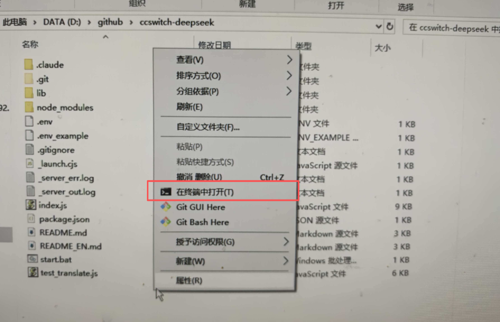

# ccswitch-deepseek

[English](README_EN.md)

---

让 Codex CLI 通过 DeepSeek 模型运行。

Codex 使用 OpenAI Responses API 协议，DeepSeek 只提供 Chat Completions API。本项目在本地启动一个协议翻译代理，在两者之间无缝转换。

## 快速开始

### 1. 安装 Node.js

本项目需要 Node.js 环境。请访问 [Node.js 官网](https://nodejs.org/) 下载并安装最新 LTS 版本。

安装完成后，在命令行中验证：

（在这个项目文件夹中点击右键出现菜单打开命令行）



```bash
node --version
npm --version
```

### 2. 安装依赖

```bash
npm install
```

### 3. 配置 API Key

复制 `env_example` 后命名为 `.env` 并编辑：

```
api_key=sk-your-deepseek-api-key
```

### 4. 启动服务

```bash
npm start
```

服务启动后，运行 Codex CLI 即可自动通过本代理连接 DeepSeek。

## 文件结构

| 文件 | 说明 |
|------|------|
| `index.js` | HTTP 服务主入口 |
| `lib/log.js` | 彩色日志工具 |
| `lib/translate.js` | 输入翻译 (Responses -> Chat) |
| `lib/sse.js` | SSE 事件翻译 (Chat -> Responses) |
| `lib/recover.js` | reasoning_content 自动记忆与补回 |
| `test_translate.js` | 翻译逻辑单元测试 (33 用例) |

## 翻译覆盖

### 输入 (Responses -> Chat Completions)

- message items (`input_text` / `output_text` / `reasoning_text`)
- `function_call` -> assistant `tool_calls`
- `function_call_output` -> `tool` message
- `reasoning` items（跳过，保留 `reasoning_content`）
- `developer` role -> `system`
- `input_image` -> `image_url`（多模态）
- `input_file` / `input_audio` -> 跳过统计

### 输出 (Chat Completions -> Responses SSE)

- `response.created` / `in_progress` / `completed`
- `output_item.added` / `done`
- `output_text.delta` / `done` + `content_part.added` / `done`
- `reasoning_text.delta` / `done` + `content_part.added` / `done`
- `function_call_arguments.delta` / `done`
- `usage` token 统计（`response.completed` 中）

### 请求参数

- `instructions` -> system message
- `temperature` / `top_p` / `max_output_tokens` 透传
- `tools` / `tool_choice` 翻译
- `thinking` / `reasoning` -> DeepSeek thinking 模式
- `reasoning_content` 跨轮次自动补回

## 运行测试

```bash
npm run test:translate
```

33 个翻译逻辑单元测试，不依赖网络。

## License

ISC

